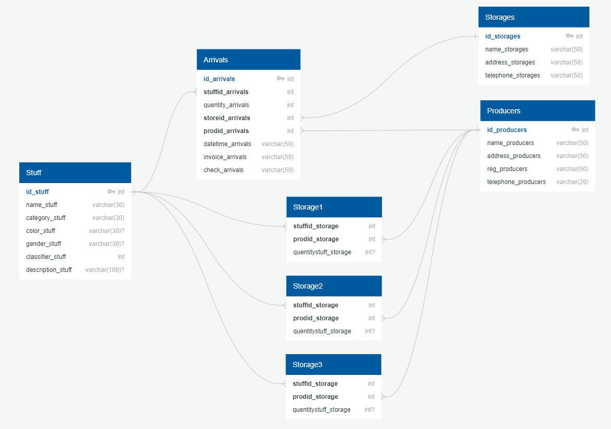

# InternetShop

Web application development as a course work on the subject of Methods and means of designing information systems and technologies

## Description

The project is an internet shop management system that allows the administrator to monitor the supply of goods. The implementation involves creating a web application using the Flask framework. The program consists of two parts. The first part is db_connection, which connects to the PostgreSQL database and performs queries to provide data from tables. The second part is responsible for presenting data to the client. Connection to the database is made using the sql_alchemy library.


## Database schema




## Used libraries

- Flask
- SQLAlchemy
- Requests

## Project structure
```
.  
├── [db_connection](https://github.com/filka657/InternetShop/tree/develop/db_connection/)/                      # folder for the database connection module  
|    ├── main.py                                                                                                # full description of the tasks  
|    └── README.md                                                                                              # short description of the tasks  
|  
├── [static](https://github.com/filka657/InternetShop/tree/develop/static)
|    ├── [css](https://github.com/filka657/InternetShop/tree/develop/static/css)
|    ├── [fonts](https://github.com/filka657/InternetShop/tree/develop/static/fonts)
|    └── [pics](https://github.com/filka657/InternetShop/tree/develop/static/pics)
|
├── [templates](https://github.com/filka657/InternetShop/tree/develop/templates)
|    ├── [putting](https://github.com/filka657/InternetShop/tree/develop/templates/putting)
|    ├── [adding](https://github.com/filka657/InternetShop/tree/develop/templates/adding)
|    └── *.html 
|
├── [main.py](https://github.com/filka657/InternetShop/blob/develop/main.py)
└── README.md                           # you are here
```
